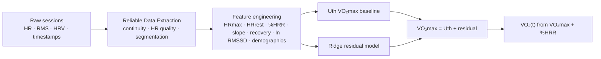

# 🫀 VO₂ & VO₂max Estimation from Wearable Heart-Rate Data

Estimate a person's **VO₂max** (maximal oxygen uptake, a key measure of cardiorespiratory fitness) and a **time-varying VO₂(t)** from everyday wearable signals: heart rate, accelerometer movement and readiness HRV. No lab treadmill test needed at inference time.


| 📄 Project document | 🔬 Segmentation notebook | 🤖 Prediction notebook |
|:---:|:---:|:---:|
| [Google Doc](https://docs.google.com/document/d/1iVSv0T32S8UnDJSDZ31XoRWubMcw7VvJZ_CcjniTnN4/edit?usp=drive_link) | [](https://colab.research.google.com/drive/12s0U2uDoph-irh3rMujlStkf3aZa_B4_?usp=sharing) | [](https://colab.research.google.com/drive/1xG61bwV37L5DtPnkZ7q37d2pUNbLI3i_?usp=sharing) |

---

## 📌 Table of Contents
1. [Overview](#-overview)
2. [How it works](#-how-it-works)
3. [Repository structure](#-repository-structure)
4. [Setup](#-setup)
5. [Quick start](#-quick-start)
6. [Method summary](#-method-summary)
7. [Results](#-results)
8. [Limitations and future work](#-limitations-and-future-work)
9. [Documentation](#-documentation)

---

## 🔎 Overview

The dataset contains **training and readiness sessions from 10 subjects**, with:

- Heart rate (HR) and HR-quality flags
- Accelerometer RMS (movement intensity)
- Timestamps
- Readiness HRV information

VO₂max is only available as a **single subject-level label** (no continuous VO₂ at every timestamp), so the project is split into two stages:

1. **Reliable data extraction**: find trustworthy HR/movement segments in raw sessions.
2. **VO₂ / VO₂max prediction**: combine a physiological formula with a small, regularised ML model.

## ⚙️ How it works



## 📁 Repository structure

```
VO2-Estimation/
├── README.md                              ← you are here (project overview + setup)
├── Reliable Data Extraction/
│   └── README.md                          ← segmentation / data-quality pipeline
└── VO2 and VO2max prediction model/
    └── README.md                          ← features, models, validation, results
```

| Folder | Purpose | Details |
|---|---|---|
| [`Reliable Data Extraction`](https://github.com/Sivanesh27/VO2-Estimation/tree/main/Reliable%20Data%20Extraction) | Turns raw sessions into clean, continuous, high-quality segments | [README](https://github.com/Sivanesh27/VO2-Estimation/tree/main/Reliable%20Data%20Extraction#readme) |
| [`VO2 and VO2max prediction model`](https://github.com/Sivanesh27/VO2-Estimation/tree/main/VO2%20and%20VO2max%20prediction%20model) | Builds features and predicts VO₂max and VO₂(t) | [README](https://github.com/Sivanesh27/VO2-Estimation/tree/main/VO2%20and%20VO2max%20prediction%20model#readme) |

## 🛠️ Setup

### Option A: Google Colab (zero install)
Click the Colab badges at the top of this page. Upload your data when prompted and run the cells top to bottom.

### Option B: Run locally

**Requirements:** Python 3.9+ and `git`.

```bash
# 1. Clone
git clone https://github.com/Sivanesh27/VO2-Estimation.git
cd VO2-Estimation

# 2. Create a virtual environment (recommended)
python -m venv .venv
source .venv/bin/activate          # Windows: .venv\Scripts\activate

# 3. Install dependencies
pip install numpy pandas scipy scikit-learn matplotlib jupyter

# 4. Launch notebooks
jupyter notebook
```

> The Colab notebooks are the reference implementation. If you export them as `.ipynb` or `.py` into the folders above, the same commands apply.

## 🚀 Quick start

1. Open the **segmentation** notebook (or the `Reliable Data Extraction` folder) and run it on your raw sessions to produce reliable segments.
2. Open the **prediction** notebook (or the `VO2 and VO2max prediction model` folder), point it at the extracted segments plus the subject table (age, sex, height, weight, VO₂max label) and run all cells.
3. Review the per-subject outputs and the Leave-One-Person-Out summary.

## 🧠 Method summary

| Step | What happens |
|---|---|
| Preprocessing | Timestamp continuity, HR quality, missing-data checks, session segmentation |
| HR smoothing | Rolling median filter |
| HRmax | Observed high-HR distribution, with Tanaka as reference: `HRmax = 208 − 0.7 × age` |
| HRrest | Resting/readiness HR, or estimated from reliable readiness data |
| Baseline | Uth: `VO₂max = 15.3 × HRmax / HRrest` |
| HR reserve | `HRR = HRmax − HRrest`, `%HRR = (HR − HRrest) / (HRmax − HRrest)` |
| Other features | HR–movement slope, high/low movement response, 60 s HR recovery, `ln(RMSSD)`, age, sex, BMI |
| Model | Residual learning: `VO₂max = Uth VO₂max + Ridge(residual)` (~11 subject-level features) |
| Validation | Leave-One-Person-Out (LOPO) |
| Continuous VO₂ | `VO₂max + %HRR → VO₂(t)` |

**Why not a TCN?** With about 10 independent labelled subjects and no time-aligned continuous VO₂, a deep temporal network would overfit. A regularised residual model on physiologically meaningful features is the safer choice.

## 📊 Results

Leave-One-Person-Out predictions vs. measured VO₂max (mean absolute difference across the 10 subjects ≈ **5.82 ml/kg/min**):

| Athlete | Target VO₂max (ml/kg/min) | Predicted VO₂max (ml/kg/min) | Difference | Sequential VO₂ data | Full model output |
|---|:---:|:---:|:---:|:---:|:---:|
| Ajay D | 59.4 | 52.5 | 6.9 | [Click here](https://drive.google.com/file/d/1hpUqVKVhJk3HxHU1-1p4VG6aDynAIsUA/view?usp=drive_link) | [Click here](https://drive.google.com/drive/folders/18jrJb2qIHER-UKGIEdYaWNWB14HJqufH?usp=drive_link) |
| Akash Raj | 57 | 52.6 | 4.4 | [Click here](https://drive.google.com/file/d/1Wgua9gPGSBkZBBhXsntipxCmiOxxNVbJ/view?usp=drive_link) | [Click here](https://drive.google.com/drive/folders/1LPkzHoNhJMSDTP3m7qFUEhVIgq7fPMpf?usp=drive_link) |
| Yuvan Shravan S | 42.2 | 53 | 10.8 | [Click here](https://drive.google.com/file/d/1uwRKNEDd68lThVN_38_AwsZ9bM-hXH80/view?usp=drive_link) | [Click here](https://drive.google.com/drive/folders/1MaZ527gmqu2CBybT-zF7EgHYKxbEH1De?usp=drive_link) |
| Gokul Krishna | 47.1 | 52.7 | 5.6 | [Click here](https://drive.google.com/file/d/1H7FpbpEbvvujLGSaFNNHn1SBG1vyWAfj/view?usp=drive_link) | [Click here](https://drive.google.com/drive/folders/1eLpiW_lnzjfPXcWYqFlYyxDTYfTbAS3-?usp=drive_link) |
| Jayaraman T | 58.8 | 52.6 | 6.2 | [Click here](https://drive.google.com/file/d/1vzLFSt_rXqVCpAPScyhXQs9jd47-e9Oc/view?usp=drive_link) | [Click here](https://drive.google.com/drive/folders/1IcjgFHz3bzZOVv9mU7Xr_8-YvKhRrFop?usp=drive_link) |
| Manoj Kumar S | 45.4 | 52.7 | 7.3 | [Click here](https://drive.google.com/file/d/16XLt64J1Aj493ORuzP3EGkmhlSwTGpSQ/view?usp=drive_link) | [Click here](https://drive.google.com/drive/folders/1XaI4VbBGNZ67LnSI7AA-cB6lfbZFOq2i?usp=drive_link) |
| Mithra M R | 50 | 53.1 | 3.1 | [Click here](https://drive.google.com/drive/folders/13RCPDtwZzrXJEs6uGdym1-KctiPcyBZK?usp=drive_link) | [Click here](https://drive.google.com/drive/folders/13RCPDtwZzrXJEs6uGdym1-KctiPcyBZK?usp=drive_link) |
| Nirmal Kumar | 61.5 | 53.6 | 7.9 | [Click here](https://drive.google.com/file/d/1qV5f9PA_miflq4ErYEZ2OuwQy1ciFiRz/view?usp=drive_link) | [Click here](https://drive.google.com/drive/folders/1hhIm4BAbVBCRgJAEoW9ha4xZI5owLJY_?usp=drive_link) |
| Sarabeshwar L | 50.6 | 52.9 | 2.3 | [Click here](https://drive.google.com/drive/folders/1X-CkOg5E6-bW_YsAAZAUPw_SZEde6SqY?usp=drive_link) | [Click here](https://drive.google.com/drive/folders/1X-CkOg5E6-bW_YsAAZAUPw_SZEde6SqY?usp=drive_link) |
| Vignesh V | 56.3 | 52.6 | 3.7 | [Click here](https://drive.google.com/file/d/1jXQVhFvwyEEL7A9-vd_3EeuxP0NLOWCs/view?usp=drive_link) | [Click here](https://drive.google.com/drive/folders/11i2aO6KYR88_25blDmnMCEVcUcAEKx7-?usp=drive_link) |

## ⚠️ Limitations and future work

- **Tiny cohort (n = 10).** Results show the pipeline works end to end but are not clinically validated.
- **Predictions are compressed.** Predicted values sit in a narrow band (≈ 52.5–53.6) while targets span 42.2–61.5, so the model currently captures the average well but separates low- and high-fitness athletes poorly. This is the main thing to improve.
- Next steps: more subjects, additional sub-maximal reference tests, richer recovery and HR-kinetics features, and revisiting temporal models once continuous VO₂ ground truth exists.

## 📚 Documentation

- 📄 [Project summary document (Google Doc)](https://docs.google.com/document/d/1iVSv0T32S8UnDJSDZ31XoRWubMcw7VvJZ_CcjniTnN4/edit?usp=drive_link): working, algorithm and results table
- 🔬 [Segmentation Colab](https://colab.research.google.com/drive/12s0U2uDoph-irh3rMujlStkf3aZa_B4_?usp=sharing)
- 🤖 [Prediction Colab](https://colab.research.google.com/drive/1xG61bwV37L5DtPnkZ7q37d2pUNbLI3i_?usp=sharing)
- 🗂️ [Reliable Data Extraction README](https://github.com/Sivanesh27/VO2-Estimation/tree/main/Reliable%20Data%20Extraction)
- 🗂️ [Prediction model README](https://github.com/Sivanesh27/VO2-Estimation/tree/main/VO2%20and%20VO2max%20prediction%20model)

---
<sub>Repository: [https://github.com/Sivanesh27/VO2-Estimation](https://github.com/Sivanesh27/VO2-Estimation)</sub>
