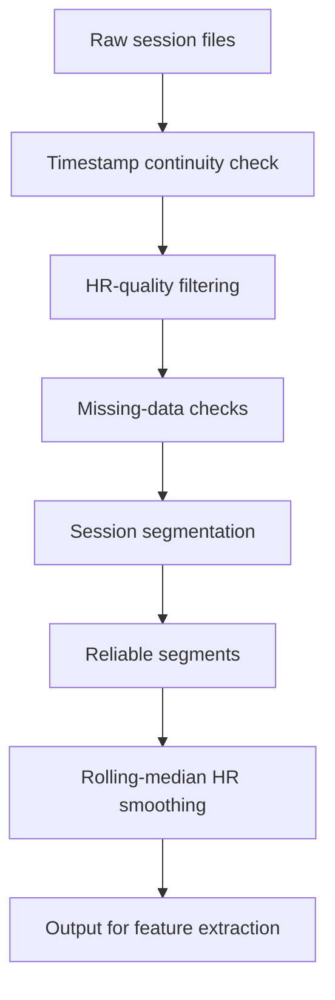

# 🧹 Reliable Data Extraction

Part of [VO₂ & VO₂max Estimation](https://github.com/Sivanesh27/VO2-Estimation). This module turns raw wearable sessions into **clean, continuous, trustworthy segments** that the [prediction model](https://github.com/Sivanesh27/VO2-Estimation/tree/main/VO2%20and%20VO2max%20prediction%20model) can safely use.

[](https://colab.research.google.com/drive/12s0U2uDoph-irh3rMujlStkf3aZa_B4_?usp=sharing)  ·  [Project document](https://docs.google.com/document/d/1iVSv0T32S8UnDJSDZ31XoRWubMcw7VvJZ_CcjniTnN4/edit?usp=drive_link)  ·  [Back to main README](https://github.com/Sivanesh27/VO2-Estimation#readme)

---

## 🎯 Why this step matters

Wearable HR data is noisy: sensors lose contact, timestamps skip, and motion corrupts readings. Features such as HRmax, %HRR, HR recovery and HR–movement slope are only meaningful on reliable data, so this step runs **before** any feature extraction.

## 📥 Inputs

| Signal | Used for |
|---|---|
| Heart rate (HR) | Core physiological signal |
| HR-quality information | Rejecting unreliable readings |
| Accelerometer RMS | Movement intensity per sample |
| Timestamps | Continuity checks and session boundaries |
| Readiness HRV data | Resting HR and RMSSD |

Data comes from **10 subjects**, with both *training* and *readiness* sessions.

## 🔧 Pipeline



1. **Timestamp continuity**: detect gaps and jumps, and split where the signal is no longer continuous.
2. **HR quality**: drop samples flagged as low quality.
3. **Missing-data checks**: discard segments with too many missing values.
4. **Session segmentation**: separate training from readiness sessions and split long recordings into usable segments.
5. **Smoothing**: a rolling median filter reduces spikes before physiological features are calculated.

## 📤 Outputs

- Reliable, time-continuous HR + RMS segments per subject
- Smoothed HR ready for HRmax, HRrest, %HRR, recovery and slope features
- Readiness segments used for resting HR and `ln(RMSSD)`

These outputs are the input to the [VO₂ and VO₂max prediction model](https://github.com/Sivanesh27/VO2-Estimation/tree/main/VO2%20and%20VO2max%20prediction%20model).

## ▶️ How to run

**Colab (easiest):** open the [segmentation notebook](https://colab.research.google.com/drive/12s0U2uDoph-irh3rMujlStkf3aZa_B4_?usp=sharing), upload the raw session files and run all cells.

**Locally:**

```bash
git clone https://github.com/Sivanesh27/VO2-Estimation.git
cd VO2-Estimation
python -m venv .venv && source .venv/bin/activate     # Windows: .venv\Scripts\activate
pip install numpy pandas scipy matplotlib jupyter
jupyter notebook
```

Then open the notebook from the `Reliable Data Extraction` folder and run it on your data.

## ✅ Quality criteria at a glance

| Check | Goal |
|---|---|
| Timestamp continuity | No unexplained gaps inside a segment |
| HR quality | Only high-quality samples retained |
| Missing data | Segments with excessive gaps excluded |
| Session type | Training and readiness handled separately |

## 🔗 Related

- [Main README](https://github.com/Sivanesh27/VO2-Estimation#readme)
- [Prediction model README](https://github.com/Sivanesh27/VO2-Estimation/tree/main/VO2%20and%20VO2max%20prediction%20model)
- [Project document](https://docs.google.com/document/d/1iVSv0T32S8UnDJSDZ31XoRWubMcw7VvJZ_CcjniTnN4/edit?usp=drive_link)
